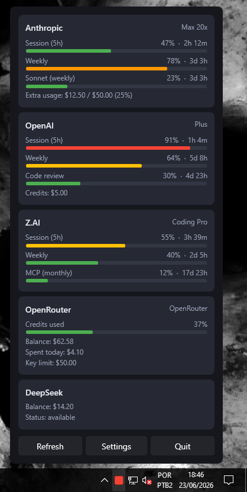
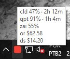
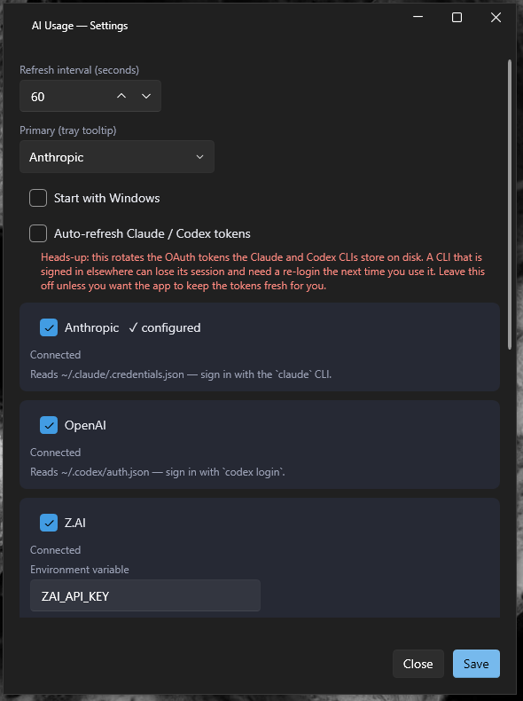

# ai-usagebar-win

> **Attribution:** This project is a structural evolution of the original
> [ai-usagebar-win](https://github.com/FranzoiDev/ai-usagebar-win) by
> Gabriel Franzoi. The WPF UI and concept were preserved, but the internal
> architecture was refactored to act as a wrapper around the
> [`ai-usagebar`](https://github.com/akitaonrails/ai-usagebar) Rust CLI,
> delegating all API calls and credential management to the native binary.

Windows system-tray app that shows AI plan usage at a glance.

Built with **C# and WPF** on .NET 8, styled with
[`WPF-UI`](https://github.com/lepoco/wpfui) for a Fluent look (Mica backdrop,
dark theme, modern controls). The tray icon uses
[`H.NotifyIcon`](https://github.com/HavenDV/H.NotifyIcon); config is TOML via
[`Tomlyn`](https://github.com/xoofx/Tomlyn). The popup and settings windows
are native XAML.

## How it works

This app does **not** call AI provider APIs directly. It periodically executes
`ai-usagebar usage --json` (the Rust CLI installed via `cargo`) and parses the
JSON output into WPF view-models. All provider configuration, credential
management and API communication are handled by the Rust binary.

## Prerequisites

- [**ai-usagebar**](https://github.com/akitaonrails/ai-usagebar) installed and
  available in `PATH` (install with `cargo install ai-usagebar`).
- Provider credentials configured as described in the `ai-usagebar` README.

## Screenshots

| Popup - click the tray icon | Tray tooltip - hover |
| :---: | :---: |
|  |  |

| Settings |
| :---: |
|  |

## UI

- **Hover** the tray icon for a one-line-per-provider tooltip.
- **Click** the tray icon for a popup with a card and progress bars per
  provider.
- **Settings** (button in the popup) opens a window to set the refresh
  interval, choose the primary provider, and toggle **Start with Windows**.
- **Quit** (button in the popup) exits the whole process.

The icon color tracks worst-case usage: green <50%, yellow >=50%, orange >=75%,
red >=90%.

## Config

Optional, and split across two files:

- `%APPDATA%\ai-usagebar-win\settings.toml` holds `poll_seconds`, the refresh
  interval (default 60, minimum 15). This file belongs to the Windows app.
- `%APPDATA%\ai-usagebar\config\config.toml` holds `[ui] primary`, the provider
  shown first in the tooltip and popup. This file belongs to the Rust CLI.

Keep `poll_seconds` out of the CLI's file. The CLI rejects unknown top-level
keys and refuses to parse the whole file, which leaves the app showing only a
System Error.

All other settings (providers, API keys, credentials) are managed by the
`ai-usagebar` Rust CLI. Use `Settings > Open config.toml` or edit the file
manually. "Start with Windows" lives in the per-user `HKCU\...\Run` registry
key.

## Build

Requires:

- **.NET 8 SDK**
- **Windows 10 2004 (19041) or later** - WPF is Windows-only.
- Optional: **Visual Studio 2022** with the *.NET Desktop Development* workload.

```powershell
# from the repo root
dotnet restore AiUsageBar.sln
dotnet build  AiUsageBar.sln -c Release -p:Platform=x64

# run
dotnet run --project AiUsageBar/AiUsageBar.csproj -p:Platform=x64
```

Or open `AiUsageBar.sln` in Visual Studio, set the platform to **x64**, and
press F5.

## Deploy

WPF publishes to a **single self-contained `.exe`** that runs on a clean
machine. The self-contained / single-file / RID flags are passed at *publish*
time only:

```powershell
dotnet publish AiUsageBar/AiUsageBar.csproj -c Release -p:Platform=x64 `
  -r win-x64 --self-contained true -p:PublishSingleFile=true
```

Pushing a version tag (e.g. `git tag v2026.8.1 && git push origin v2026.8.1`)
runs the `release` GitHub Actions workflow, which publishes the build and
attaches the `.exe` to a GitHub Release.

On first run the app adds a **Start Menu shortcut** (per-user, no admin needed),
so you can find it from Windows Search by typing "AI Usage Bar". Only one
instance runs at a time - launching it again while it's in the tray just
reopens the popup. **Quit** (in the popup) closes it.

## Layout

| Path | Purpose |
|---|---|
| `Models/Interop.cs` | JSON deserialization model for `ai-usagebar usage --json` |
| `Models/ViewModels.cs` | popup + settings view-models bound by XAML |
| `Services/Config.cs` | TOML config load/save (poll interval, UI primary) |
| `Services/Poller.cs` | background polling loop - executes the Rust CLI |
| `Services/Renderer.cs` | JSON results -> tooltip + popup/settings view-models |
| `Services/TrayIconFactory.cs` | severity-tinted tray icon drawn in code |
| `Services/TrayService.cs` | H.NotifyIcon wrapper |
| `Services/StartupService.cs` | "Start with Windows" via the HKCU Run key |
| `Services/ShortcutService.cs` | Start Menu shortcut so Search can find the app |
| `Services/NativeMethods.cs` | Win32 interop (cursor position, DPI) |
| `Views/PopupWindow.xaml` | frameless popup anchored near the tray |
| `Views/SettingsWindow.xaml` | settings form (Fluent window) |
| `App.xaml.cs` | tray-first app wiring; single-instance + shortcut on first run |
| `Converters.cs` | XAML value converters (severity to brush, bool to visibility) |

## License

MIT. See [LICENSE](LICENSE).

Based on [FranzoiDev/ai-usagebar-win](https://github.com/FranzoiDev/ai-usagebar-win).
Data layer powered by [akitaonrails/ai-usagebar](https://github.com/akitaonrails/ai-usagebar).
